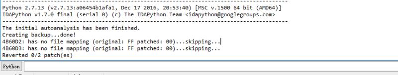

# TP-LINK TL-WR940N / TL-WR941ND-缓冲区溢出  CVE-2017-13772


## 简介
固件下载地址 https : //static.tp-link.com/TL-WR940N(US)_V4_160617_1476690524248q.zip


## 解压
Ubuntu下的binwalk  Binwalk v2.1.2   解压不了
最终kali下binwalk 能解决

## 查看信息

直接运行可以查看固件具体安装了什么服务
```
squashfs-root qemu-mips-static -L ./ bin/busybox
bin/busybox: cache '/etc/ld.so.cache' is corrupt
BusyBox v1.01 (2016.06.17-08:21+0000) multi-call binary

Usage: busybox [function] [arguments]...
   or: [function] [arguments]...

	BusyBox is a multi-call binary that combines many common Unix
	utilities into a single executable.  Most people will create a
	link to busybox for each function they wish to use and BusyBox
	will act like whatever it was invoked as!

Currently defined functions:
	[, arping, brctl, busybox, cat, chmod, date, df, echo, ethreg, false, getty, hostname, ifconfig, init, insmod, ip, kill, klogd, linuxrc, ln, logger, login, logread, ls, lsmod, mount, msh,
	ping, ps, reboot, rm, rmmod, route, sh, syslogd, test, tftp, true, udhcpc, udhcpd, umount, vconfig

```

查看rcS文件获取到开机运行哪些操作

可以看到运行了httpd服务，所以分析目标文件就放到了httpd文件上面
```
➜  squashfs-root cat ./etc/rc.d/rcS
#!/bin/sh

# This script runs when init it run during the boot process.
# Mounts everything in the fstab

mount -a
#mount -o remount +w /

#
# Mount the RAM filesystem to /tmp
#

mount -t ramfs -n none /tmp
mount -t ramfs -n none /var

export PATH=$PATH:/etc/ath

#insmod /lib/modules/2.6.15/net/ag7100_mod.ko
#insmod /lib/modules/2.6.15/net/ag7240_mod.ko

#
# Set lo eth1 up
#
ifconfig lo 127.0.0.1 up
#ifconfig eth1 up

#
# insert netfilter/iptables modules
#

/etc/rc.d/rc.modules

#
# Start Our Router Program
#

/usr/bin/httpd &

echo 524288 > /proc/sys/net/ipv4/ipfrag_high_thresh

echo 1 > /proc/sys/net/netfilter/nf_conntrack_tcp_be_liberal

#for SMB memory fragment
echo 3 >/proc/sys/vm/dirty_background_ratio
echo 75 >/proc/sys/vm/dirty_ratio
echo 200 >/proc/sys/vm/vfs_cache_pressure
```
## 收获

```
  httpStatusSet(uParm1,0);
  httpHeaderGenerate(uParm1);  /*产生THHP头*/
```
在使用`httpGetEnv`获取参数之前运行

## 仿真运行

### 遇到问题

 在ida修改过之后保存的时候输出如下，我进行的修补被跳过了
 
 