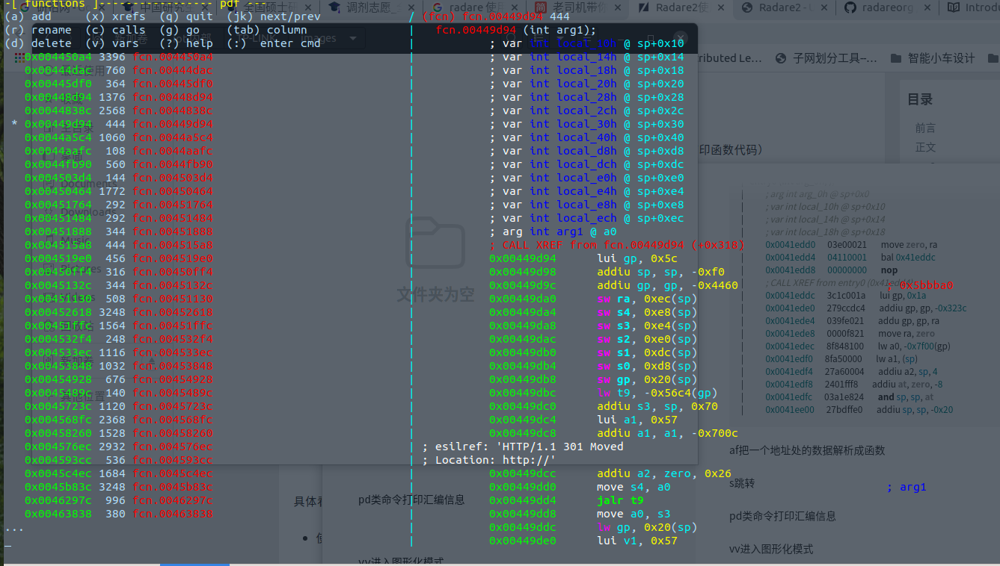
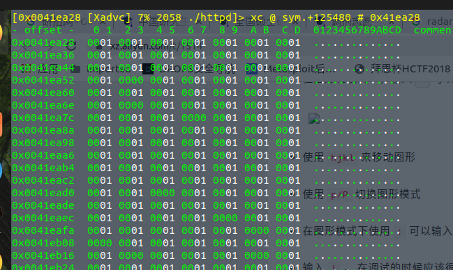

# radera2使用

加载二进制文件
```
Desktop r2 ./httpd
WARNING: Cannot initialize section headers
WARNING: Cannot initialize strings table
WARNING: Cannot initialize dynamic strings
[0x0041edd0]> 

```

px命令从当前地址处打印16进制数据
```
[0x0041edd0]> px
- offset -   0 1  2 3  4 5  6 7  8 9  A B  C D  E F  0123456789ABCDEF
0x0041edd0  03e0 0021 0411 0001 0000 0000 3c1c 001a  ...!........<...
0x0041ede0  279c cdc4 039f e021 0000 f821 8f84 8100  '......!...!....
0x0041edf0  8fa5 0000 27a6 0004 2401 fff8 03a1 e824  ....'...$......$
0x0041ee00  27bd ffe0 8f87 80e4 8f88 a624 afa8 0010  '..........$....
0x0041ee10  afa2 0014 afbd 0018 8f99 a254 0320 f809  ...........T. ..
0x0041ee20  0000 0000 1000 ffff 0000 0000 0000 0000  ................
0x0041ee30  3c1c 005c 27bd ffd8 279c bba0 afbf 0024  <..\'...'......$
0x0041ee40  afb2 0020 afb1 001c afb0 0018 afbc 0010  ... ............
0x0041ee50  3c02 005b 9042 6b70 0000 0000 1440 0022  <..[.Bkp.....@."
0x0041ee60  3c03 0059 3c02 0059 2463 703c 2442 7040  <..Y<..Y$cp<$Bp@
0x0041ee70  0043 1023 0002 1083 2450 ffff 0060 9021  .C.#....$P...`.!
0x0041ee80  1000 0006 3c11 005b 8c79 0000 0000 0000  ....<..[.y......
0x0041ee90  0320 f809 ae24 6b74 8fbc 0010 8e22 6b74  . ...$kt....."kt
0x0041eea0  0000 0000 2444 0001 0004 1880 0050 102b  ....$D.......P.+
0x0041eeb0  1440 fff5 0072 1821 8f82 adb8 0000 0000  .@...r.!........
0x0041eec0  1040 0007 2403 0001 8f99 adb8 3c04 0059  .@..$.......<..Y

```

aaa 对程序进行完整分析（像ida的加载分析一样）
```
[0x0041edd0]> aaa
[x] Analyze all flags starting with sym. and entry0 (aa)
[x] Analyze value pointers (aav)
[x] Value from 0x005b6a50 to 0x005e6d28 (aav)
[x] 0x005b6a50-0x005e6d28 in 0x5b6a50-0x5e6d28 (aav)
[x] 0x005b6a50-0x005e6d28 in 0x597000-0x5b6a50 (aav)
[x] 0x005b6a50-0x005e6d28 in 0x400000-0x586778 (aav)
[x] Value from 0x00597000 to 0x005b6a50 (aav)
[x] 0x00597000-0x005b6a50 in 0x5b6a50-0x5e6d28 (aav)
[x] 0x00597000-0x005b6a50 in 0x597000-0x5b6a50 (aav)
[x] 0x00597000-0x005b6a50 in 0x400000-0x586778 (aav)
[x] Value from 0x00400000 to 0x00586778 (aav)
[x] 0x00400000-0x00586778 in 0x5b6a50-0x5e6d28 (aav)
[x] 0x00400000-0x00586778 in 0x597000-0x5b6a50 (aav)
[x] 0x00400000-0x00586778 in 0x400000-0x586778 (aav)
[x] Emulate code to find computed references (aae)
[x] Analyze function calls (aac)
[x] Analyze len bytes of instructions for references (aar)
[x] Constructing a function name for fcn.* and sym.func.* functions (aan)
[x] Type matching analysis for all functions (aaft)
[x] Use -AA or aaaa to perform additional experimental analysis.
```

pdf 打印汇编指令
```
[0x0041edd0]> pdf
            ;-- pc:
/ (fcn) entry0 92
|   entry0 (int arg_0h, );
|           ; arg int arg_0h @ sp+0x0
|           ; var int local_10h @ sp+0x10
|           ; var int local_14h @ sp+0x14
|           ; var int local_18h @ sp+0x18
|           0x0041edd0      03e00021       move zero, ra
|           0x0041edd4      04110001       bal 0x41eddc
|           0x0041edd8      00000000       nop
|           ; CALL XREF from entry0 (0x41edd4)
|           0x0041eddc      3c1c001a       lui gp, 0x1a
|           0x0041ede0      279ccdc4       addiu gp, gp, -0x323c
|           0x0041ede4      039fe021       addu gp, gp, ra
|           0x0041ede8      0000f821       move ra, zero
|           0x0041edec      8f848100       lw a0, -0x7f00(gp)
|           0x0041edf0      8fa50000       lw a1, (sp)
|           0x0041edf4      27a60004       addiu a2, sp, 4
|           0x0041edf8      2401fff8       addiu at, zero, -8
|           0x0041edfc      03a1e824       and sp, sp, at
|           0x0041ee00      27bdffe0       addiu sp, sp, -0x20

```

af把一个地址处的数据解析成函数

s跳转

pd类命令打印汇编信息

vv进入图形化模式



使用 hjkl 来移动图形(上下左右也可以)

p切换图形模式

用 ：可以使用radare2命令

使用 空格 ，切换图形模式和文本模式
 
 
## patch
` Desktop r2 -w ./httpd`加-w参数以可写模式打开
 
 用s 0x004B60D0跳转到想要修改的地方
 
pdf可以查看汇编代码

px可以查看十六进制

oo+ 将二进制文件更改为读写	

写入之前
```
[0x004b60d0]> px
- offset -   0 1  2 3  4 5  6 7  8 9  A B  C D  E F  0123456789ABCDEF
0x004b60d0  2404 ffff 8fbf 001c 0080 1021 03e0 0008  $..........!....
0x004b60e0  27bd 0020 3c1c 005c 27bd ffe0 279c bba0  '.. <..\'...'...
0x004b60f0  afbf 001c afb0 0018 afbc 0010 3c02 005a  ............<..Z

```

```
[0x004b60d0]> wv 0x24040000
[0x004b60d0]> px
- offset -   0 1  2 3  4 5  6 7  8 9  A B  C D  E F  0123456789ABCDEF
0x004b60d0  2404 0000 8fbf 001c 0080 1021 03e0 0008  $..........!....
0x004b60e0  27bd 0020 3c1c 005c 27bd ffe0 279c bba0  '.. <..\'...'...
0x004b60f0  afbf 001c afb0 0018 afbc 0010 3c02 005a  ............<..Z
0x004b6100  8c42 e580 afa5 0024 1c40 0006 0080 8021  .B.....$.@.....!
```
