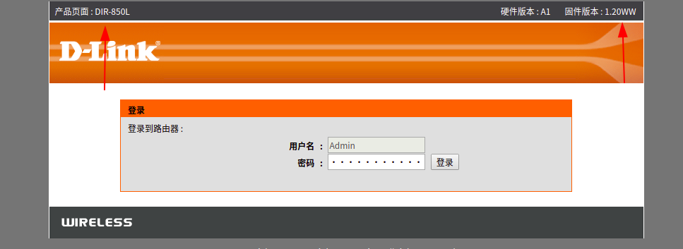
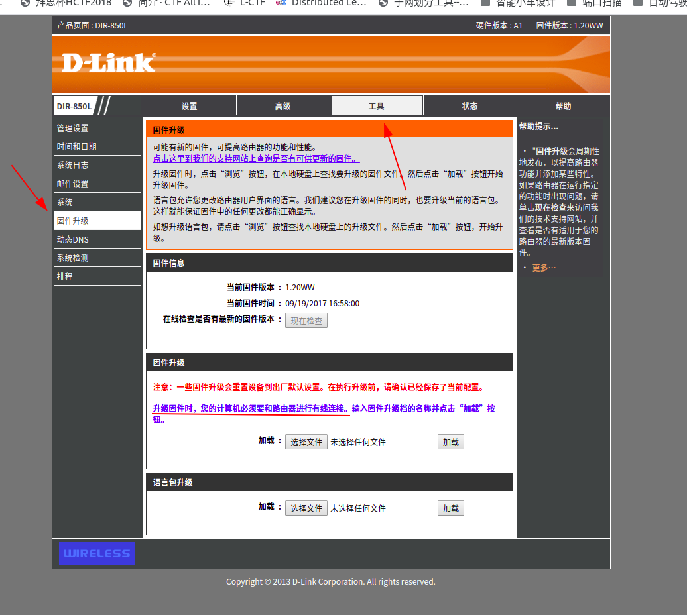
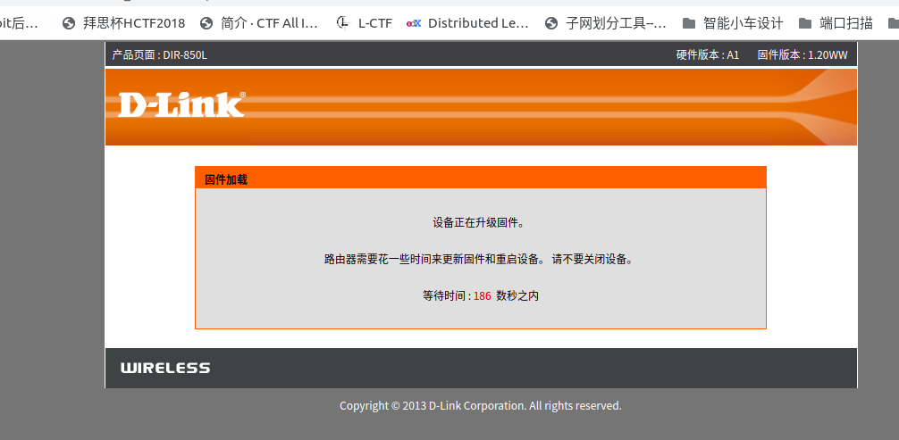

## 前言

## 案例二    dir850L降级

### 实验环境

1. 笔记本电脑
2. D-link 路由器

### 设备信息

- 设备名称：D-link路由器
- 设备型号：DIR-850L
- 固件版本：1.20WW

### 测试过程

**下载固件**

可以来这里下载指定版本的固件

http://www.dlinktw.com.tw/techsupport/ProductInfo.aspx?m=DIR-850L

访问192.168.0.1  出现登录界面.可以看到固件版本和产品型号

 

输入用户名密码之后进入配置页面，找到配置

 
 
按照提示，连接有线网线，选择下载好的固件点击加载

 
 
 
 
 

