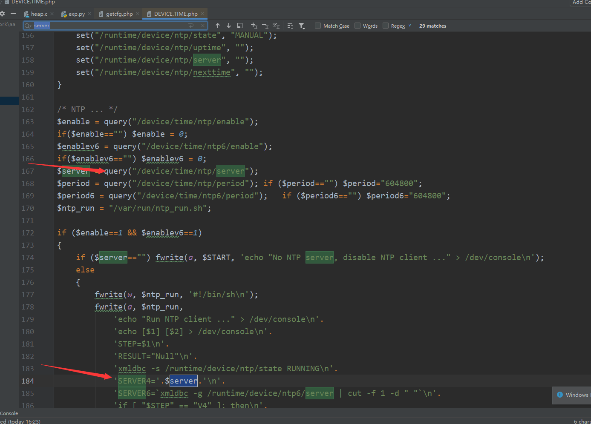

## 漏洞类型总结
### 信息泄露
**1、非登录用户直接可读登录界面以外的界面**

**2、在url里设置字段可以进入登录界面**

参考
https://blog.csdn.net/qq_38204481/article/details/105113896

Dlink Dir850L设置AUTHORIZED_GROUP>0字段即可绕过安全检查

空密码绕过：如果使用strncmp来校验密码是否与原密码相同使用空密码可绕过
```c
#include<stdio.h>
#include<assert.h>
 
int main()
{
	char a[]="aaaae";
	char b[]="";
	int i=strcmp(a,b);//不同返回-1相同返回0
	printf("%d\n",i);
	//相同返回-1不同返回0
	int j=strncmp(a,b,1);//只比较前n个字符
 
	printf("%d\n",j);
 
	return 0;
}
```
输出结果：
```
-1
-1
```
****
### 命令执行
**开启telnet组合命令：**
```
telnetd -l /bin/sh -p 2309 &
telnet 192.168.1.1 2309
```
**保存命令到文件的时候命令中可以插入自己的命令**
主要表现形式为阶截断命令



`"metelesku; ("+COMMAND+") & exit;`

本来存入文件的命令可以使用\`reboot\`来截断，然后插入自己的命令
****
### 目录穿越漏洞
使用 ../xxx  可以穿越到上一级
****

### 栈溢出
**某些字段没有限制造成溢出**


**某些为了过滤特殊字符造成溢出**


```
wr841N在转义\n的时候把\n转化成了<br>一个字节变成了四个字节造成了溢出
```
```
int stringModify(char *dest, int len, int src)
{
       char src_index;
       char *src_index_a_1;
       int index;
       if ((dest == (char *)0x0) || (src_index_a_1 = (char *)(src + 1), src == 0)) 
{
              index = -1;
       }
       else {
              index = 0;
              while (true) {
                     src_index = src_index_a_1[-1];
                     if ((src_index == '\0') || (len <= index)) break;/* src为空或当index等于长度时结束 */
                     if (src_index == '/') {   //处理 /  
                     LAB_0043bb48:
                           *dest = '\\';
                     LAB_0043bb4c:
                           index = index + 1;
                           dest = dest + 1;/*  /添加转义字符，变为\/ */
                     LAB_0043bb54:
                           *dest = src_index_a_1[-1];
                           dest = dest + 1;
                     }
                     else {                     //处理其他字符
                           if ('/' < src_index) {//左斜杠为2F小于0的ascii  （处理数字和字母）
                                  if ((src_index == '>') || (src_index == '\\')) 
goto LAB_0043bb48;
                                  if (src_index == '<') {
                                         *dest = '\\';
                                         goto LAB_0043bb4c;  //>，<，\\变为  
\>>,\<<,\//
                                  }
                                  goto LAB_0043bb54;
                           }  //下面是ascii小于x2f的字符
                           if (src_index != '\r') {//\r的ascii为DH                       （处理\r,\",\n）
                                  if (src_index == '\"') goto LAB_0043bb48;//22h
                                  if (src_index != '\n') goto LAB_0043bb54;//AH
                           }
                           if ((*src_index_a_1 != '\r') && (*src_index_a_1 != 
'\n')) {//处理前一个为\r或\n  后一个不是\r或\n 的组合字符  
                                  *dest = '<';    // <br>
                                  dest[1] = 'b';
                                  dest[2] = 'r';
                                  dest[3] = '>';
                                  dest = dest + 4;
                           }
                     }   //else结束
                     index = index + 1;//index表示已经拷贝的长度（包含转义字符\）
                     src_index_a_1 = src_index_a_1 + 1;
              }
              *dest = '\0';
       }
       return index;
}
```
****
### 拒绝服务
```
v11 = getenv("HTTP_REFERER");            
ptr = strdup(v11);
```


