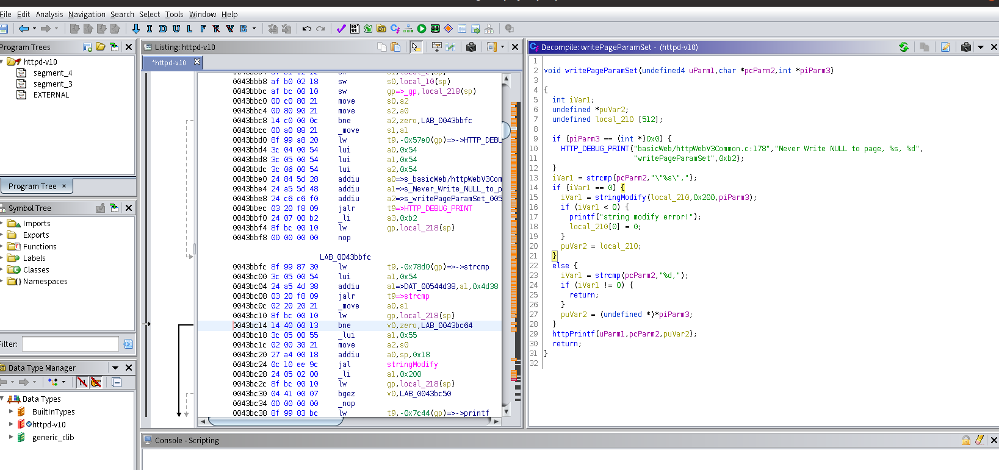
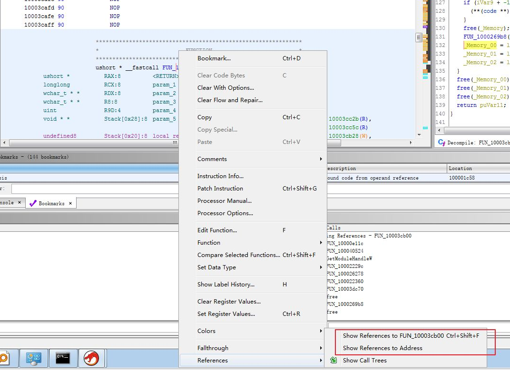
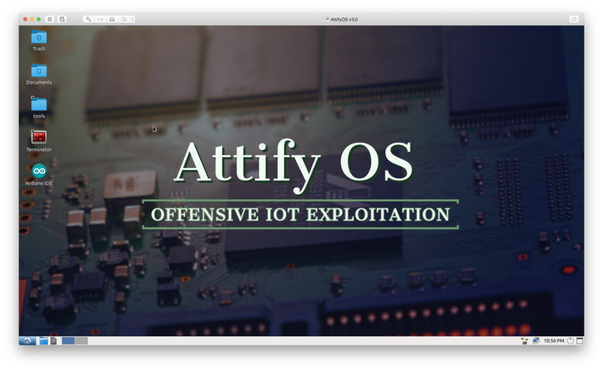
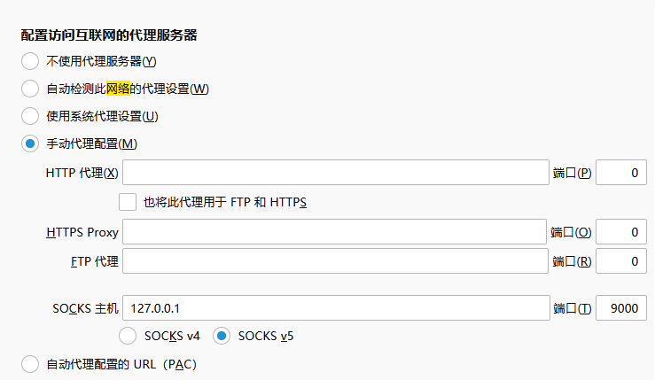
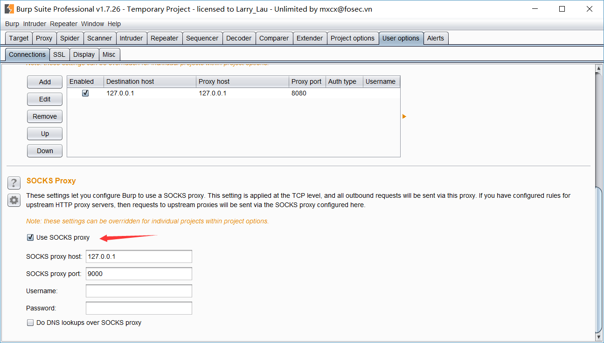

# iot环境配置总结

## 配置
win10

Ubuntu16虚拟机

## 说明
刚入门很大的一个问题是不知道要安装什么软件，对于网上搭建环境的教程都只是告诉安装什么工具，一通乱搞最后不知道自己装了什么。

文章将讲述入门的iot安全研究员需要安装哪些工具，这些工具都是做什么的。只涉及最基础工具

## 静态分析

### 查看镜像文件具体内容
**binwalk**
拿到的固件是一个bin文件，需要用binwalk解压然后找到具体要分析的文件。

从镜像文件（bin文件，是整个磁盘的dump文件）提取出来文件系统（是存放用户文件的地方，是 / 目录）

安装：
```
sudo apt install binwalk
```
使用方法
```
binwalk -Me xxx.bin
参数：递归，解压
```
注：很多拿到的固件是不能解压的，只能手动分析。

### 分析镜像文件内容

这里的工具会反编译从上一步中取出来的具体文件（比如 httpd）

分析二进制文件

**ida**  对于搞二进制的非常常用，不再介绍。

**ghidra** 用于反编译mips架构（一种cpu架构，路由器比较常用，跟arm，x86，amd一类）的程序。ida只能看到mips架构程序的汇编，这个工具可以反编译。结合ida使用。

效果如图
 
 
 下载 https://ghidra-sre.org/
（暂时不能用，在其他地方找资源吧）

常用命令：

g：跳转到某个地址或函数

ctrl+shift+e 搜索字符串

查找交叉引用



## 动态分析

### 简单动态仿真

没有真实设备的时候为了能看到开启的界面，进行简单测试。

用fat，使用比较简单，一条命令就够了。
https://github.com/attify/firmware-analysis-toolkit

但是安装极其恶心，可以使用attifyOs虚拟机（里面的~/tools/firmware-analysis-toolkit工具）

主页https://www.attify.com/attifyos

界面比较丑，可能有一些莫名的错误（我遇到了一个不能从windows主机拖文件进虚拟机的问题，解决不了，用scp来共享文件）。
 
 

### 抓取数据包分析

仿真起来之后就可以用别人的poc对对应固件程序进行测试了但是测试过程中需要清楚具体发送和接收了什么，抓包！抓包！抓包！

使用**brupsuit** 和 **wireshark** 

有这样一个场景，仿真环境在attify os虚拟机的内网里面跑着，想要在本地分析它，如图(fat在仿真的时候会把创建qemu虚拟机，把固件在qemu虚拟机里面启动)
 

使用 `ssh -D 127.0.0.1:9000 user@ip`进行端口转发。

然后浏览器设置socks5代理，可以像在attifyos虚拟机里面一样访问它的内网
 
 
brupsuit在上述场景里面需要设置两层代理设置这里
 
先填ip，端口，然后按enter再勾选（不然可能勾选不了，真是蛋疼）

到这里就一般简单漏洞都可以复现了（如命令注入），但是有些复杂还需要动态的调试（如栈溢出）
### 动态调试


#### qemu安装与配置

qemu可以模拟硬件架构，可以在qemu虚拟机里面运行从固件中拿到的文件（qemu是安装到Ubuntu虚拟机里面的）。

但是运行之前需要把文件从Ubuntu虚拟机拷贝到qemu虚拟机里面，还需要动态调试（qemu虚拟机里面的gdbserver，连接Ubuntu虚拟机里的gdb）。这里就需要配置一个网络，让qemu虚拟机和Ubuntu虚拟机通信

配置流程如下

 - 安装qemu
 - 配置网桥
 - 准备运行qemu虚拟机
 - 运行qemu虚拟机

安装：

qemu两种模式，系统模式和用户模式。之后将具体介绍
```
apt install qemu-system-mips
apt install qemu-user-static
```

**启动qemu用户模式**

用户模式不需要配置网络，下面这条命令可一直接调试，去掉-g选项就能直接运行。

这个命令将会启动简单qemu模拟环境，方便，但是可能会有未知错误
```
qemu -L ./ -E LD_PRELOAD=/hook_mips -g ./usr/bin/httpd 
```
```
-L 指定命令运行的根目录
-E 添加环境变量
-g可以启动gdb进行调试
```
**启动qemu系统模式（这个会启动一个系统，虽然比较麻烦但是环境比较完整，减少一些错误）**

配置网络：

安装依赖，接下来将创建一个网桥，把Ubuntu主机网卡和qemu虚拟机网卡桥接到同一个网桥上
```
sudo apt-get install bridge-utils uml-utilities
```
/etc/network/interfaces文件里面写入
```
auto lo
iface lo inet loopback

#auto eth0
iface eth0 inet manual
#up ifconfig eth0 0.0.0.0 up
#iface eth0 inet dhcp
#eth0不需要配置

#配置网桥信息
auto br0 
iface br0 inet dhcp 
  bridge_ports eth0 
  bridge_stp off
  bridge_maxwait 1 
```
在/etc/qemu-ifup文件的开始添加，在qemu启动的时候会执行这里把qemu虚拟机网卡添加到网桥上
```
#!/bin/sh
echo "Executing /etc/qemu-ifup"
echo "Bringing $1 for bridged mode..."
sudo /sbin/ifconfig $1 0.0.0.0 promisc up
echo "Adding $1 to br0..."
sudo /sbin/brctl addif br0 $1
sleep 3
```
用`service networking restart`重启网络

可以用下面指令手动开启网桥（如果正常的话上面的配置就可以完成关闭eth0网卡，开启网桥）

```
sudo ifdown eth0
sudo ifup br0
```
qemu启动起来之后还要对qemu虚拟机进行简单配置（设置一个ip，要和网桥同一个网段）
```
这里是动态ip
配置/etc/network/interface
auto eth0
iface eth0 inet dhcp
```
注：网桥相当于一个交换机，虚拟网桥会和本机eth0绑定，其作用：
 - qemu虚拟机和主机之间通信
 - 虚拟网桥ip就作为本机ip（外部访问本机要用虚拟网桥ip比如ssh）

和https://blog.csdn.net/qq_38204481/article/details/105391866 互为补充

在启动之前还需要获取其他架构的磁盘文件和linux内核，这里写了一个简单脚本，在深夜无人的时候偷偷一次性下载，（应该不到20个G）
```
mkdir ./arm64
wget -c -P ./arm64 https://people.debian.org/~aurel32/qemu/amd64/README.txt
wget -c -p ./arm64 https://people.debian.org/~aurel32/qemu/amd64/debian_squeeze_amd64_standard.qcow2 
wget -c -p ./arm64 https://people.debian.org/~aurel32/qemu/amd64/debian_wheezy_amd64_standard.qcow2


mkdir ./armel
wget -c -P ./armel https://people.debian.org/~aurel32/qemu/armel/README.txt
wget -c -P ./armel https://people.debian.org/~aurel32/qemu/armel/debian_squeeze_armel_standard.qcow2 
wget -c -P ./armel https://people.debian.org/~aurel32/qemu/armel/debian_wheezy_armel_standard.qcow2
wget -c -P ./armel https://people.debian.org/~aurel32/qemu/armel/initrd.img-2.6.32-5-versatile 
wget -c -P ./armel https://people.debian.org/~aurel32/qemu/armel/vmlinuz-3.2.0-4-versatile 


mkdir ./i386 
wget -c -P ./i386 https://people.debian.org/~aurel32/qemu/i386/README.txt
wget -c -P ./i386 https://people.debian.org/~aurel32/qemu/i386/debian_squeeze_i386_standard.qcow2
wget -c -P ./i386 https://people.debian.org/~aurel32/qemu/i386/debian_wheezy_i386_standard.qcow2

mkdir ./armhf
wget -c -P ./armhf https://people.debian.org/~aurel32/qemu/armhf/README.txt
wget -c -P ./armhf https://people.debian.org/~aurel32/qemu/armhf/debian_wheezy_armhf_standard.qcow2
wget -c -P ./armhf https://people.debian.org/~aurel32/qemu/armhf/initrd.img-3.2.0-4-vexpress
wget -c -P ./armhf https://people.debian.org/~aurel32/qemu/armhf/vmlinuz-3.2.0-4-vexpress


mkdir ./kfreebsd-amd64
wget -c -P ./kfreebsd-amd64 https://people.debian.org/~aurel32/qemu/kfreebsd-amd64/README.txt
wget -c -P ./kfreebsd-amd64 https://people.debian.org/~aurel32/qemu/kfreebsd-amd64/debian_squeeze_kfreebsd-amd64_standard.qcow2
wget -c -P ./kfreebsd-amd64 https://people.debian.org/~aurel32/qemu/kfreebsd-amd64/debian_wheezy_kfreebsd-amd64_standard.qcow2

mkdir ./kfreebsd-i386
wget -c -P ./kfreebsd-i386 https://people.debian.org/~aurel32/qemu/kfreebsd-i386/README.txt
wget -c -P ./kfreebsd-i386 https://people.debian.org/~aurel32/qemu/kfreebsd-i386/debian_squeeze_kfreebsd-i386_standard.qcow2
wget -c -P ./kfreebsd-i386 https://people.debian.org/~aurel32/qemu/kfreebsd-i386/debian_wheezy_kfreebsd-i386_standard.qcow2

mkdir ./mips
wget -c -P ./mips https://people.debian.org/~aurel32/qemu/mips/README.txt
wget -c -P ./mipshttps://people.debian.org/~aurel32/qemu/mips/debian_squeeze_mips_standard.qcow2
wget -c -P ./mipshttps://people.debian.org/~aurel32/qemu/mips/debian_wheezy_mips_standard.qcow2
wget -c -P ./mipshttps://people.debian.org/~aurel32/qemu/mips/vmlinux-2.6.32-5-4kc-malta
wget -c -P ./mipshttps://people.debian.org/~aurel32/qemu/mips/vmlinux-2.6.32-5-5kc-malta
wget -c -P ./mipshttps://people.debian.org/~aurel32/qemu/mips/vmlinux-3.2.0-4-4kc-malta
wget -c -P ./mipshttps://people.debian.org/~aurel32/qemu/mips/vmlinux-3.2.0-4-5kc-malta

mkdir ./mipsel
wget -c -P ./mipsel https://people.debian.org/~aurel32/qemu/mipsel/README.txt
wget -c -P ./mipsel https://people.debian.org/~aurel32/qemu/mipsel/debian_squeeze_mipsel_standard.qcow2
wget -c -P ./mipsel https://people.debian.org/~aurel32/qemu/mipsel/debian_wheezy_mipsel_standard.qcow2
wget -c -P ./mipsel https://people.debian.org/~aurel32/qemu/mipsel/vmlinux-2.6.32-5-4kc-malta
wget -c -P ./mipsel https://people.debian.org/~aurel32/qemu/mipsel/vmlinux-2.6.32-5-5kc-malta
wget -c -P ./mipsel https://people.debian.org/~aurel32/qemu/mipsel/vmlinux-3.2.0-4-4kc-malta
wget -c -P ./mipsel https://people.debian.org/~aurel32/qemu/mipsel/vmlinux-3.2.0-4-5kc-malta
```


1、开启qemu虚拟机


```
qemu-system-mips -M malta -kernel vmlinux-3.2.0-4-4kc-malta -hda debian_squeeze_mips_standard.qcow2 -nographic -append "root=/dev/sda1 rw console=tty0 init=/linuxrc ignore_loglevel" -net nic,vlan=0 -net tap,vlan=0,ifname=tap0 -redir tcp:2333::2333 -redir tcp:8080::80
```


2、配置mips下软件运行环境（只是系统模式可以）
 - `scp -r xxx root@ip:/root` 使用scp把提取出来的固件的文件系统拷贝到qemu虚拟机
 - `mount --bind /proc ./proc` 需要在上一步拷贝的目录里面运行（映射运行环境，减少很多错误）
 - `chroot . bin/sh `  更改运行的根目录，让软件找到自己的依赖库
 - `./usr/bin/httpd`   运行需要运行的软件

#### 安装交叉编译链
交叉编译的含义是让你能在intel的x86架构下编译其他架构的软件。想要调试mips架构的程序还需要编译一些东西，在这里安装编译工具

mips（表示mips架构32位大端 MSB）
```
sudo apt-get install linux-libc-dev-mips-cross 
sudo apt-get install libc6-mips-cross libc6-dev-mips-cross 
sudo apt-get install binutils-mips-linux-gnu gcc-mips-linux-gnu 
sudo apt-get install g++-mips-linux-gnu
```
mipsel （表示mips架构32位小端 LSB）
```
sudo apt-get install linux-libc-dev-mipsel-cross
sudo apt-get install libc6-mipsel-cross libc6-dev-mipsel-cross
sudo apt-get install binutils-mipsel-linux-gnu gcc-mipsel-linux-gnu
sudo apt-get install g++-mipsel-linux-gnu
```


#### 配置gdb和gdbserver

上一步只是讲解如何运行起来，但是想要调试还需要一些其他的准备（这一步也是系统模式才需要的）

**安装gdb，编译gdbserver**

gdb需要安装gdb-multiarch，这个工具应该是在gdb的基础上加了一层壳，所以gdb的版本和配置还会保留
```
sudo apt install gdb-multiarch
```
编译gdbserver：

划重点：编译之前记得先新建虚拟机快照，不然卸载很恶心

除了需要gdb还需要一个配套的gdbserver需要满足
 - 跟被调试的软件同一架构
 - 需要静态链接，不用依赖一堆动态库，之后的调试会很方便
 
Ubuntu16阿里云源里面默认安装的是gdb7.11.1
 
从这里下载对应gdb版本 https://ftp.gnu.org/gnu/gdb/
 
```
指定c编译器，c++编译器，指定目标文件的运行平台。
--prefix指定安装路径，三条命令成功运行之后文件会放在/root/tgdb目录里面
LDFLAGS="-static"指定静态链接


CC="mips-linux-gnu-gcc" CXX="mips-linux-gnu-g++" ./configure --target=mips-linux-gnu --host="mips-linux-gnu" --prefix="/root/tgdb" LDFLAGS="-static"
make 
make install
```
用上面三条命令进行编译（记得快照）

用上面的命令编译好的配套的gdb和gdbserver在 `./测试代码/gdb-mips-MSB-static`

#### 启动gdb和gdbserver开始调试

在qemu虚拟机里面运行下面的命令来启动调试

```
gdbserver.mipsbe attach 0.0.0.0:12345 pid
或者 gdbserver.mipsbe 0.0.0.0:6666 /test
```

在Ubuntu主机里面运行

```
gdb-multiarch
gef➤ set architecture mips      设置架构
The target architecture is assumed to be mips
gef➤ gef-remote -q 192.168.1.20:2333     远程链接    或者target remote 192.168.1.20:2333
gef➤ handle SIG32 pass            忽略一些信号，不然gdb会到处停很难受
gef➤ handle SIG33 pass
gef➤ handle SIG43 pass
```

### 解决一些问题

实际上绝大多数固件的文件是不能直接被运行的，因为里面会检查一些字段，陷入阻塞或者死循环，然后启动环境失败。

解决方案通常有两种：

 - 使用LD_PRELOAD=hook.so hook掉一些函数（主要是system函数）
 - 直接用ida   path掉

**使用hook**

hook如下代码
```
   #include <stdio.h>
   #include <stdlib.h>
   int system(const char *command){
       printf("HOOK: system(\"%s\")",command);
       return 1337;
   }
   int fork(void){
       return 1337;
   }
```
编译命令
```
mips-linux-gnu-gcc -shared -fPIC hook_mips.c -o hook_mips
```

如何hook
```
export LD_PRELOAD=./hook_mips
./gdbserver 0.0.0.0:2333  /usr/bin/httpd
或者
LD_PRELOAD="/hook" /usr/bin/httpd
```
缺少动态库：
cd到lib目录下 `ln -s libuClibc-0.9.30.so ld.so.1`

libuClibc-0.9.30.so是主要libc库（mips架构）

**使用ida path**
   
   待填充
  
  

### 动态调试测试

```
#include<stdio.h>

int vul(char* src)
{
    char output[20]={0};
    strcpy(output,src);
    printf("%s\n",output);
    return 0;
}
 
int main(int argc,char *argv[])
{
    if(argc<2){
        printf("need more argument\n");
        return 1;
    }
    vul(argv[1]);
    return 0;
}
```
编译
`mipsel-linux-gnu-gcc -g hello.c -o hello_mipsel -static`

被调试客户机启动调试（qemu虚拟机）

```
gdbserver.mipsbe attach 0.0.0.0:12345 pid
或者 gdbserver.mipsbe 0.0.0.0:6666 /test
```
调试主机（Ubuntu虚拟机）
```
gdb-multiarch
gef➤ set architecture mips
The target architecture is assumed to be mips
gef➤ gef-remote -q 192.168.1.20:2333
```

****


