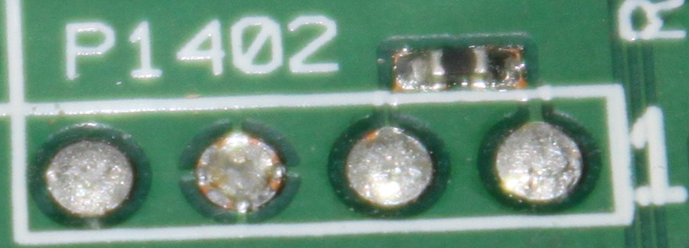
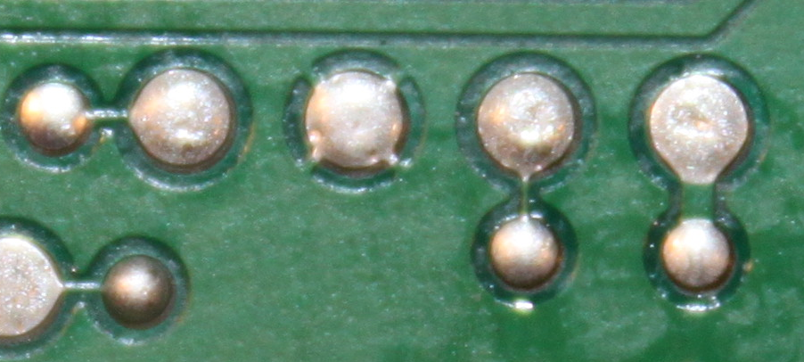
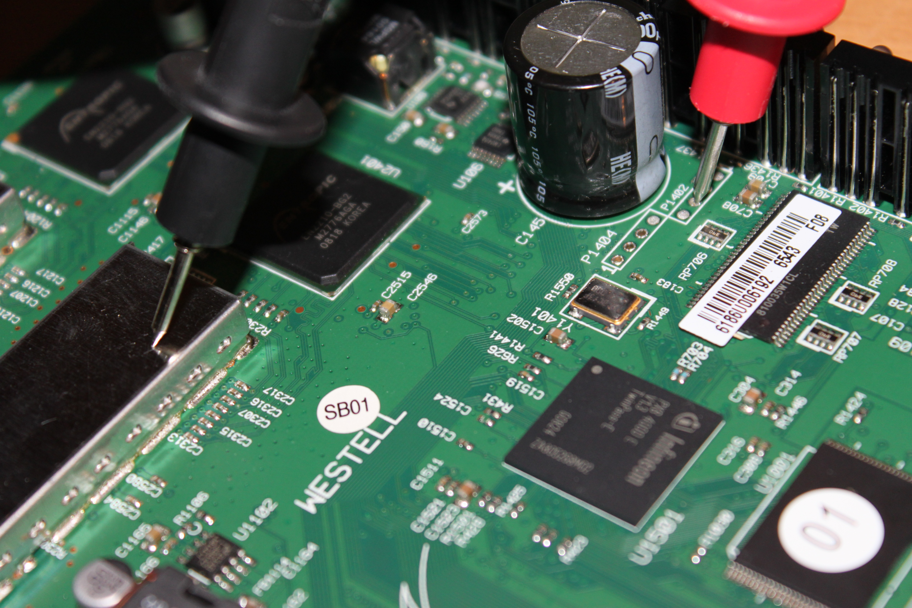

# 		调试引脚寻找

第一步是尝试识别串口标头的潜在对象。大部分的串口头至少有四个引脚：

- Vcc
- Ground
- Transmit
- Receive

## 找到待测试的引脚

一般是一些如图的引脚

## 从待测引脚中找到串口

### 观察
关键点1：上图的第三个引脚(第一个是右边第一个)有四条痕迹组成的十字图案，可以把它识别为地线。

关键点2：宽的痕迹通常用于供电的，而细的痕迹通常用于信号传输

 
 
 ## 使用万用表识别
 
 使用万用表蜂鸣档，只要有微弱电流万用表就能发声。
 
 接地引脚识别：
 
 	一个探针放到金属屏蔽上，并将另一个探针接触要探测的引脚，万用表发声，说明该引脚接地。
  
  
vcc 识别：
将万用表调到直流20V上将一只表笔放在GND测试其他哪只引脚为3.3V该引脚就是VCC

参考：https://zhuanlan.zhihu.com/p/73875084
https://hurricane618.me/2019/03/02/serial-ports-translation-cn/

（待补充）

  